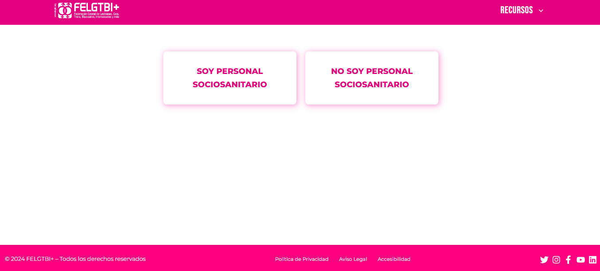
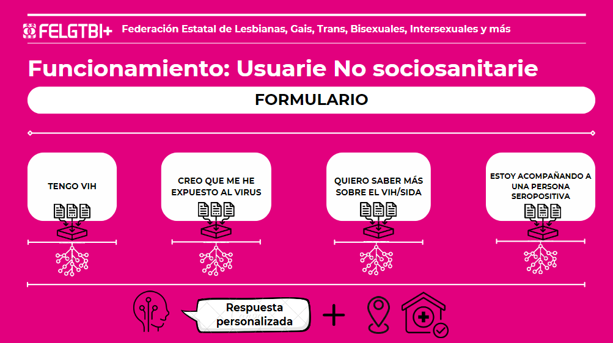
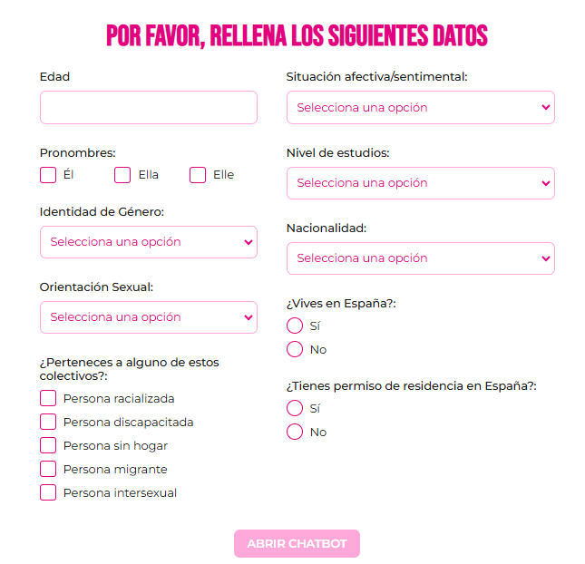
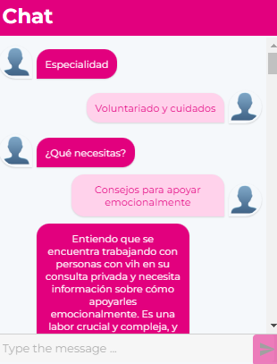
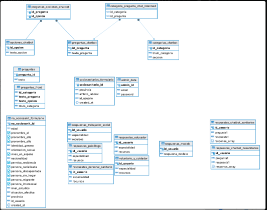
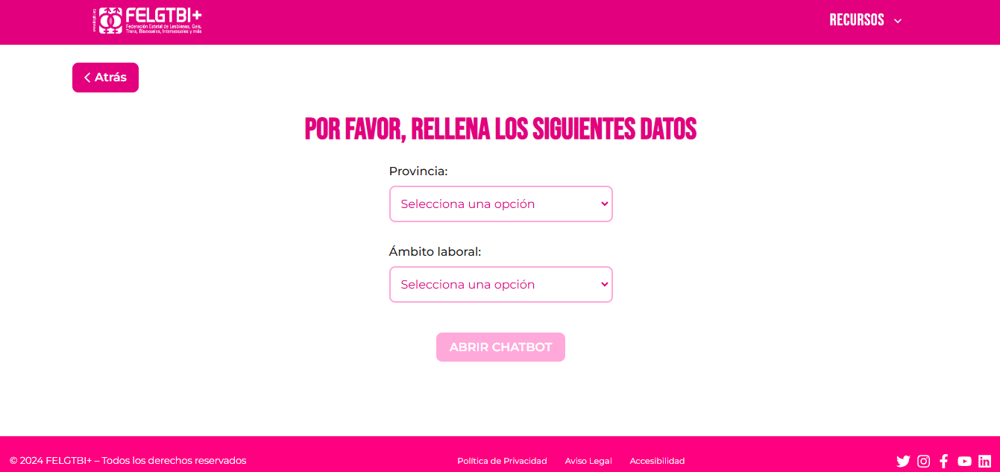
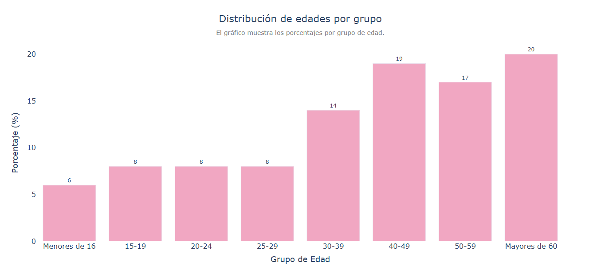
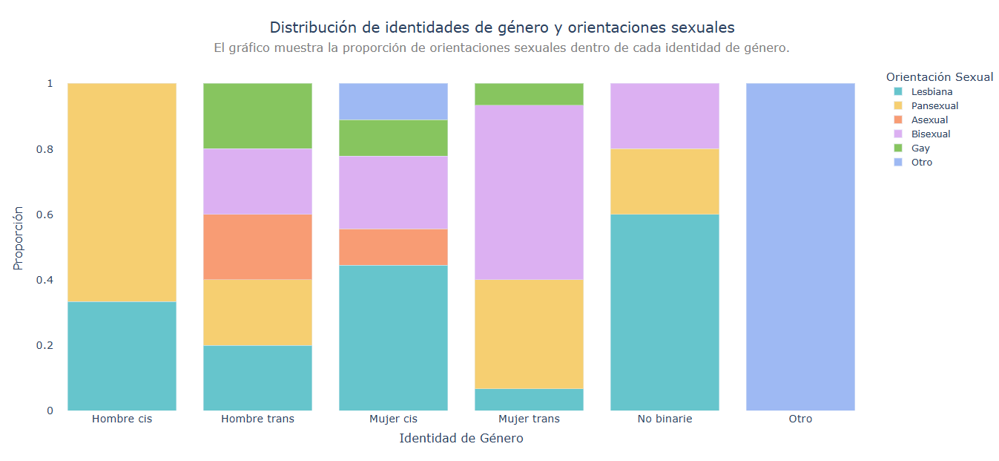
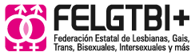

# Backend del chatbot vih360

## **Asistencia y orientación en materia de vih y sida**
## **Descripción**

### **1. Datos y problemática**

El VIH continúa siendo un desafío global de salud pública, con implicaciones que trascienden lo médico. Según ONUSIDA:
- **1,5 millones de nuevos casos** fueron reportados recientemente.
- **38 millones de personas** viven actualmente con VIH.

El impacto del virus no se limita a su dimensión física; el **estigma social asociado** puede ser incluso más devastador. Las comunidades vulnerables, como la población LGTBIQ+, enfrentan barreras significativas:
- **Prejuicios sociales** que dificultan el acceso a información y servicios libres de discriminación.
- **Falta de enfoque específico**: Las necesidades de hombres trans, mujeres lesbianas y migrantes, entre otros, suelen pasar desapercibidas.
- **Carencia de personal capacitado**: Los trabajadores sociosanitarios requieren orientación y actualizaciones regulares para garantizar una atención inclusiva y eficaz.

Estos factores destacan la urgencia de ofrecer información personalizada y accesible que fomente la equidad en salud.


---

### **2. Planteamiento**

Desde una perspectiva alineada con la **FELGTBI+**, la salud debe abordarse de forma integral:
- Dimensiones **físicas**, **emocionales** y **sociales** como pilares esenciales.
- Proveer una **herramienta segura y confiable**, que:
  - Incluya información actualizada sobre prevención y apoyo emocional.
  - Sea accesible y amigable para usuarios con diversas necesidades.

### **Principios rectores**
1. **Lenguaje inclusivo**: Adaptado a todas las identidades y realidades.  
2. **Accesibilidad**: Información clara, fácil de usar para diferentes niveles educativos.  
3. **Interseccionalidad**: Reconocer las múltiples formas de discriminación que pueden superponerse.  
4. **Amabilidad y empatía**: Fomentar la confianza en el usuario.  
5. **Diversidad de escenarios**: Incluir la mayor cantidad de casuísticas posibles.  
6. **Recopilación de estadísticas**: Para mejorar continuamente y adaptarse a las necesidades emergentes.

---

### **3. Funcionamiento**
  

La herramienta operará mediante un **árbol de decisión** interactivo:
- **Preguntas predefinidas** que guían al usuario según su situación.
- **Rutas personalizadas**:
  - Información sobre **prevención**, **pruebas diagnósticas**, **manejo emocional**, y **recursos locales**.
  - Ejemplo de rutas:
    - Una persona que sospecha una exposición reciente al VIH.
    - Un profesional sociosanitario que busca pautas de asesoramiento.
- **Evitar cajas de texto libre**: Esto permite mantener una guía clara, estructurada y un acompañamiento cercano.



### **Adaptación de la información**
La información será adaptada para ser:
- Relevante y comprensible según el perfil del usuario.
- Basada en evidencia científica y recomendaciones actualizadas.
- Accediendo ala api de **Gemini**  

  

- Dando ubicaciones cercana de centros personalizados accediendo a la api de **googlemaps**.


## **Descripción**

Plataforma web diseñada para brindar información, recursos y asistencia a personas que necesitan apoyo en temas relacionados con el VIH y SIDA. Nuestra misión es derribar barreras de acceso a información confiable, ofrecer herramientas de autoevaluación y conectar a las personas con servicios de apoyo y orientación.

La aplicación está dirigida a:  
- Personas diagnosticadas con VIH.  
- Personas interesadas en aprender sobre prevención, tratamiento y cuidados.  
- Profesionales de la salud que buscan recursos adicionales.  
- Comunidad general que desea información fiable y empática.

Esta seria la interfaz principal 


---

## **Características Principales**

- **Recursos informativos:** Artículos detallados sobre prevención, tratamiento, mitos y realidades.  
- **Asistencia personalizada:** Acceso a orientación profesional a través de un sistema de chat o foros anónimos.  
- **Autoevaluación:** Herramientas interactivas para evaluar riesgos y obtener recomendaciones.  
- **Mapa de servicios:** Localización de clínicas, centros de prueba y organizaciones de apoyo cercanas.  
- **Noticias y actualizaciones:** Información actualizada sobre avances en el tratamiento y leyes relacionadas con el VIH/SIDA.

---

## **Tecnologías Utilizadas**


### **Backend**
- Fastapi
- Modelo LLM de Gemini  
- Base de datos alojada en AWS(irlanda) 


### **Frontend** 
- Tiene

## **Instalación y Configuración**

1. Pincha en el link para probarlo directamente.


2. Clona este repositorio si quieres acceder al coódigo  
   ```bash
   git clone https://github.com/usuario/repo.git


### participantes:
-Hugo
-Ana
-Nathan
-Fran
-Javier
### Tecnologias


import requirements:
fastapi==0.115.5
uvicorn==0.32.1
pandas==2.2.2
matplotlib==3.8.4
psycopg2==2.9.10
python-dotenv==0.21.0
plotly==5.22.0
google-generativeai==0.8.3
kaleido==0.2.1
ipython==8.12.3
nbformat>=4.2.0
googlemaps==4.10.0
langchain_community==0.3.8
python-multipart==0.0.19





## **Extructura del repositorio**

