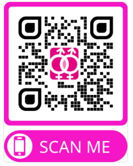

# Backend del chatbot vih360

## **Asistencia y orientación en materia de vih y sida**
## **Descripción**

### **1. Datos y problemática**

El VIH continúa siendo un desafío global de salud pública, con implicaciones que trascienden lo médico. Según ONUSIDA:
- **1,5 millones de nuevos casos** fueron reportados recientemente.
- **38 millones de personas** viven actualmente con VIH.

El impacto del virus no se limita a su dimensión física; el **estigma social asociado** puede ser incluso más devastador. Las comunidades vulnerables, como la población LGTBIQ+, enfrentan barreras significativas:
- **Prejuicios sociales** que dificultan el acceso a información y servicios libres de discriminación.
- **Falta de enfoque específico**: Las necesidades de hombres trans, mujeres lesbianas y migrantes, entre otros, suelen pasar desapercibidas.
- **Carencia de personal capacitado**: Los trabajadores sociosanitarios requieren orientación y actualizaciones regulares para garantizar una atención inclusiva y eficaz.

Estos factores destacan la urgencia de ofrecer información personalizada y accesible que fomente la equidad en salud.

   

---

### **2. Planteamiento**

Desde una perspectiva alineada con la **FELGTBI+**, la salud debe abordarse de forma integral:
- Dimensiones **físicas**, **emocionales** y **sociales** como pilares esenciales.
- Proveer una **herramienta segura y confiable**, que:
  - Incluya información actualizada sobre prevención y apoyo emocional.
  - Sea accesible y amigable para usuarios con diversas necesidades.

### **Principios rectores**
1. **Lenguaje inclusivo**: Adaptado a todas las identidades y realidades.  
2. **Accesibilidad**: Información clara, fácil de usar para diferentes niveles educativos.  
3. **Interseccionalidad**: Reconocer las múltiples formas de discriminación que pueden superponerse.  
4. **Amabilidad y empatía**: Fomentar la confianza en el usuario.  
5. **Diversidad de escenarios**: Incluir la mayor cantidad de casuísticas posibles.  
6. **Recopilación de estadísticas**: Para mejorar continuamente y adaptarse a las necesidades emergentes.

---

### **3. Funcionamiento**


La herramienta operará mediante un **árbol de decisión** interactivo:
- **Preguntas predefinidas** que guían al usuario según su situación.
- **Rutas personalizadas**:
  - Información sobre **prevención**, **pruebas diagnósticas**, **manejo emocional**, y **recursos locales**.
  - Ejemplo de rutas:
    - Una persona que sospecha una exposición reciente al VIH.
    - Un profesional sociosanitario que busca pautas de asesoramiento.
- **Evitar cajas de texto libre**: Esto permite mantener una guía clara, estructurada y un acompañamiento cercano. 


### **Adaptación de la información**
La información será adaptada para ser:
- Relevante y comprensible según el perfil del usuario.
- Basada en evidencia científica y recomendaciones actualizadas.
- Accediendo ala api de **Gemini** para la respuesta personalizada.   


- Dando ubicaciones cercana de centros específicos de vih accediendo a la api de **googlemaps**.   


---

## **4. Tratamiento de datos (no Identitario, solo Estadístico)**

El sistema garantizará el **anonimato y la confidencialidad total** mediante:
- **Registro solo de datos agregados**, como:
  - Rutas más consultadas.
  - Picos de uso para identificar demandas recurrentes.
- Utilización de estos datos para:
  - Mejorar la calidad del contenido.
  - Actualizar periódicamente las rutas del árbol de decisión.


### **Enfoque de privacidad**
El enfoque asegura que ningún dato identificable sea almacenado, promoviendo confianza entre los usuarios.

---
### **Tecnologias Utilizadas**
- Estructura de base de datos alojada en **AWS** en irlanda del tipo **PostgreSQL**   


- Para mayor cordinación con el grupo de **frontend** desplegamos la aplicacion en **Render**   


---

# **Instalación y Configuración**

1. Pincha en el link para probarlo directamente.


2. Clona este repositorio si quieres acceder al coódigo  
   ```bash
   git clone https://github.com/usuario/repo.git

3. Para tu entorno virtual:
   ```bash
   pip install requirements

4. Tambien puedes probarla scaneando el **códigoQR**   



---

## **Extructura del repositorio**
   ```bash
   FELGTBI_plus/
   ├── backend/
   │   ├── main.py
   │   ├── utils.py
   │   ├── requirements.txt
   │
   ├── Basedatos/
   │   ├── pruebas/
   │   │   ├── prueba_1.ipynb
   │   │   ├── prueba_2.ipynb
   │
   ├── Imagenes/
   │   ├── interfaz_web.png
   │   ├── diapositiva.png
   │   ├── no_sociosanitario.png
   │   ├── chatbot_2.png
   │   ├── gemini.png
   │   ├── googlemaps.png
   │   ├── grafico_barchart.png
   │   ├── barras_apiladas.png
   │
   ├── Modelos/
   │   ├── pruebas/
   │   │   ├── modelo_prueba_1.ipynb
   │   │   ├── modelo_prueba_2.ipynb
   │
   ├── presentacion_ppt/
   │   ├── presentacion.pdf
   │
   └── README.md
              


### participantes:

- Hugo Menéndez Montes
- Ana I. Montero Martín
- Nathan Jones 
- Fran M. Martínez Poyatos
- Javier Rodríguez Fontiveros


## **Extructura del repositorio**

